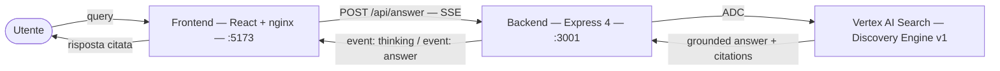
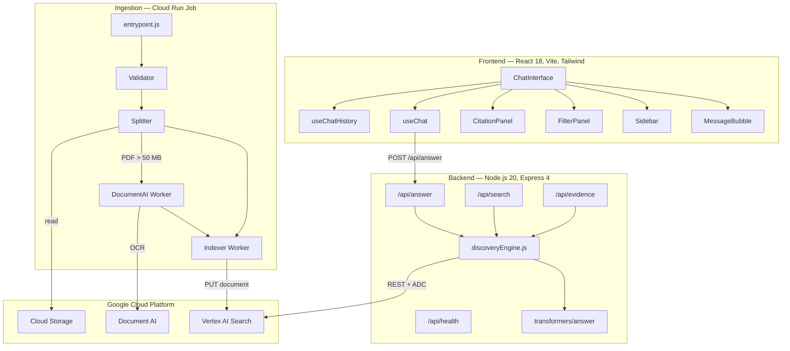
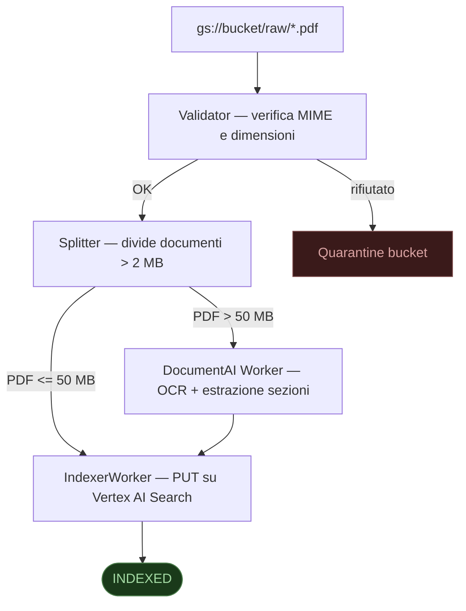
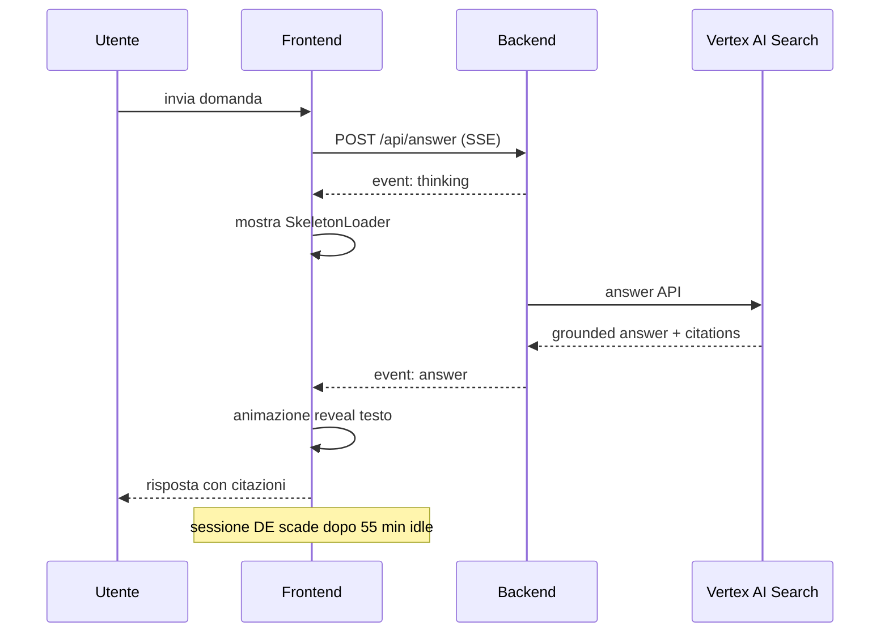

# Archivio Moby Prince

> Sistema di consultazione documentale basato su RAG (Retrieval-Augmented Generation) per gli atti della Commissione Parlamentare d'Inchiesta sul naufragio del Moby Prince (10 aprile 1991).


---

## Panoramica

L'applicazione permette di interrogare in linguaggio naturale l'intero corpus documentale della commissione — testimonianze, perizie, relazioni, verbali — e riceve risposte citate e verificabili, ancorate ai documenti originali.



---

## Quick start

**Prerequisiti:** Docker, `gcloud` CLI, un progetto GCP con Vertex AI Search configurato.

```bash
# 1 — Credenziali Google (una volta sola)
gcloud auth application-default login

# 2 — Configurazione
cp backend/.env.example backend/.env
# Modifica backend/.env: GOOGLE_CLOUD_PROJECT, ENGINE_ID, DATA_STORE_ID

# 3 — Avvio
docker compose up --build

# → http://localhost:5173
```

Il frontend nginx fa da proxy per `/api/*` → backend sulla rete Docker interna. Nessuna configurazione URL aggiuntiva richiesta.

---

## Architettura



---

## API

Tutti gli endpoint accettano e restituiscono JSON. Il backend è raggiungibile su `http://localhost:3001` in sviluppo diretto, o tramite proxy nginx su `http://localhost:5173/api/` con docker-compose.

### `POST /api/answer`

Risposta fondata con citazioni, powered by Vertex AI Search `:answer`.
La risposta è in formato **Server-Sent Events** (`text/event-stream`).

```
event: thinking   data: {"stage":"searching"}
event: answer     data: { answer: {...}, session: {...}, meta: {...} }
-- oppure in caso di errore --
event: error      data: {"message":"<messaggio in italiano>"}
```

```json
// Request body
{
  "query": "Quali furono le cause dell'incendio?",
  "sessionId": "123456789",        // opzionale — continua una sessione DE
  "filters": {                     // opzionale
    "document_type": "testimony",
    "year": 1991
  }
}

// Payload dell'evento answer
{
  "answer": {
    "text": "Secondo le testimonianze…",
    "citations": [{ "id": 1, "startIndex": 0, "endIndex": 42, "sources": […] }],
    "evidence":  [{ "title": "…", "snippet": "…", "documentId": "…" }],
    "relatedQuestions": ["…", "…"],
    "steps": []
  },
  "session": { "id": "123456789" },
  "meta": { "durationMs": 1823 }
}
```

### `POST /api/search`

Recupero puro di chunk/documenti, senza generazione di risposta.

```json
// Request
{ "query": "capitano De Falco", "maxResults": 10, "searchMode": "CHUNKS" }

// Response
{ "results": [{ "title": "…", "snippet": "…", "score": 0.91 }], "meta": {…} }
```

### `GET /api/evidence/documents/:id/chunks`

Tutti i chunk di un documento (richiede `DATA_STORE_ID`).

### `POST /api/evidence/search`

Lista piatta di evidenze per il pannello workbench.

### `GET /api/health`

Liveness probe — risponde `{ "status": "ok" }` con HTTP 200.

---

## Configurazione

### Backend (`backend/.env`)

| Variabile | Obbligo | Default | Descrizione |
|-----------|---------|---------|-------------|
| `GOOGLE_CLOUD_PROJECT` | **sì** | — | GCP project ID |
| `ENGINE_ID` | **sì** | — | Vertex AI Search engine ID |
| `GCP_LOCATION` | no | `eu` | Regione DE (`eu`, `global`, `us`) |
| `DATA_STORE_ID` | no | — | Datastore ID — abilita chunk lookup |
| `PORT` | no | `3001` | Porta HTTP |
| `NODE_ENV` | no | `development` | `production` → logging NDJSON strutturato |
| `LOG_LEVEL` | no | `debug` | `debug` · `info` · `warn` · `error` |
| `FRONTEND_ORIGIN` | no | `http://localhost:5173` | CORS origin |
| `CHUNK_CONTEXT_PREV` | no | `1` | Chunk adiacenti precedenti per risposta |
| `CHUNK_CONTEXT_NEXT` | no | `1` | Chunk adiacenti successivi per risposta |

Vedere `backend/.env.example` per il file completo.

### Ingestion (`ingestion/.env`)

Vedere `ingestion/.env.example`. Le variabili principali sono le stesse del backend più i bucket GCS (`BUCKET_RAW`, `BUCKET_NORMALIZED`, `BUCKET_QUARANTINE`) e le soglie di splitting.

---

## Pipeline di ingestion



**Avvio locale (dry run):**
```bash
cd ingestion
cp .env.example .env
INDEX_DRY_RUN=true node cloudrun/entrypoint.js ingest ./corpus/raw/documento.pdf
```

**Scan di un bucket GCS:**
```bash
node cloudrun/entrypoint.js scan gs://my-project-corpus-raw/moby-prince/
```

**Retry dei job falliti:**
```bash
node cloudrun/entrypoint.js retry
```

**Applica schema metadati al datastore:**
```bash
DATA_STORE_ID=my-store ./deploy/schema.sh
```

---

## Sviluppo locale (senza Docker)

```bash
# Backend
cd backend
cp .env.example .env     # compila le variabili GCP
npm install
npm run dev              # nodemon — riavvio automatico su modifiche

# Frontend (terminale separato)
cd frontend
npm install
npm run dev              # Vite HMR → http://localhost:5173
# Il proxy Vite inoltra /api/* → http://localhost:3001
```

**Verifica sincronizzazione schemi filtri:**
```bash
node scripts/check-filter-schema.js
# ✔  Filter schemas are in sync
```

---

## Deploy su Google Cloud

### Backend (Cloud Run)

```bash
ENGINE_ID=your-engine-id \
DATA_STORE_ID=your-datastore-id \
PROJECT=your-project-id \
  ./deploy/backend.sh
```

Costruisce l'immagine via Cloud Build, la pubblica su Artifact Registry, deploya su Cloud Run (`europe-west1`). Richiede un service account `moby-prince-backend@PROJECT.iam.gserviceaccount.com` con il ruolo `roles/discoveryengine.viewer`.

### Frontend (Cloud Storage)

```bash
BACKEND_URL=https://moby-prince-backend-xxxx-ew.a.run.app \
  ./deploy/frontend.sh
```

Oppure su Firebase Hosting:
```bash
TARGET=firebase BACKEND_URL=https://… ./deploy/frontend.sh
```

### Schema metadati

```bash
DATA_STORE_ID=your-datastore-id ./deploy/schema.sh
```

Idempotente — sicuro da rieseguire ad ogni deploy.

---

## Autenticazione

Il backend usa esclusivamente **Application Default Credentials (ADC)** — nessuna chiave hardcoded.

| Ambiente | Come vengono risolte le credenziali |
|----------|-------------------------------------|
| Locale diretto | `gcloud auth application-default login` |
| docker-compose | Stesso file, montato come volume in `~/.config/gcloud` |
| Cloud Run | Workload Identity del service account allegato |

---

## Struttura della conversazione



Il frontend gestisce conversazioni multiple persistite in `localStorage` con:

- **Debounce** (300 ms) sulle scritture per non saturare il browser
- **Eviction** automatica delle conversazioni meno recenti se `localStorage` è pieno (le conversazioni bloccate vengono preservate)
- **Scadenza sessione DE** dopo 55 minuti di inattività — toast informativo all'utente
- **Stato di caricamento per-conversazione** — si possono aprire più conversazioni senza blocchi reciproci
- **Retry automatico** su errori 502/503 con backoff esponenziale (2s, 4s)
- **Sync multi-tab** via `storage` event

---

## Stack tecnologico

| Layer | Tecnologia |
|-------|-----------|
| Frontend | React 18, Vite, Tailwind CSS, react-markdown, react-router-dom |
| Backend | Node.js 20, Express 4, helmet, express-rate-limit |
| RAG engine | Google Vertex AI Search (Discovery Engine v1) |
| Auth | Google Application Default Credentials (google-auth-library) |
| Ingestion | Cloud Run Jobs, Document AI (opzionale), Cloud Storage |
| State | localStorage (frontend) · FileStore / FirestoreStore (ingestion) |
| Logging | Structured NDJSON (pino-compatible) con request ID |
| Container | Docker, nginx 1.27 |

---

## Licenza

Uso riservato — Commissione Parlamentare d'Inchiesta · Camera dei Deputati.
