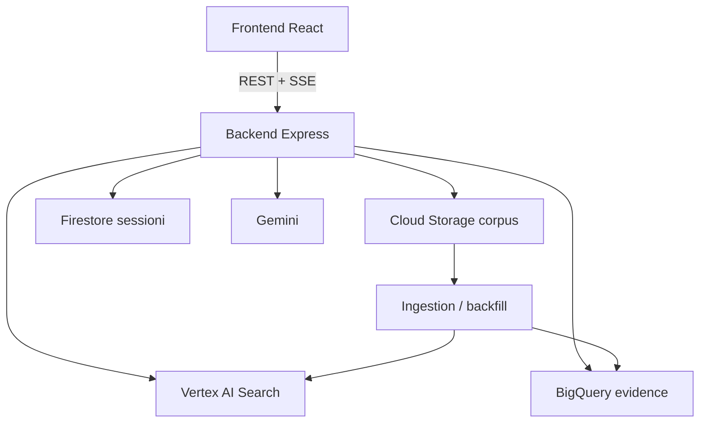

# Archivio Moby Prince

Piattaforma investigativa evidence-first sul disastro del Moby Prince. Il prodotto unisce chat con citazioni verificabili, timeline strutturata, profili entità, dossier documentali e strumenti investigativi costruiti sul corpus.

## Stato attuale

- Chat principale con risposte grounded e pannello fonti unificato
- Timeline unica basata su BigQuery con eventi, data, accuratezza e fonti multiple
- Indici separati per `persone`, `navi`, `enti`, `luoghi`
- Profilo entità con sintesi AI prudente, documenti, claim ed eventi collegati
- Dossier builder su GCS con apertura documenti e drill-down indicizzato
- Pagina investigazione con strumenti orientati a documenti, eventi ed entità
- Funzionalità di `contraddizioni` rimossa dal prodotto operativo

## Stack

- Frontend: React 18, Vite, Tailwind
- Backend: Express, SSE, servizi Google Cloud
- Retrieval: Vertex AI Search / Discovery Engine
- Structured evidence: BigQuery `evidence`
- Storage: GCS + Firestore
- Modelli: Gemini per sintesi, verifica e arricchimento
- Runtime supportato: Node 20 (`.nvmrc` presente)

## Architettura



## Superfici prodotto

| Pagina | Route | Scopo |
|---|---|---|
| Chat | `/` | Ricerca e sintesi grounded con viewer fonti |
| Timeline | `/timeline` | Ricostruzione cronologica evidence-first |
| Persone | `/persone` | Indice persone con profili dedicati |
| Navi | `/navi` | Indice navi con profili dedicati |
| Enti | `/enti` | Indice enti con profili dedicati |
| Luoghi | `/luoghi` | Indice luoghi con profili dedicati |
| Dossier | `/dossier` | Browser documentale e raccolta materiali |
| Investigazione | `/investigazione` | Agente multi-step con tool documentali |
| Admin | `/admin` | Statistiche operative |

## API principali

| Metodo | Path | Note |
|---|---|---|
| `POST` | `/api/answer` | SSE `thinking` → `answer` |
| `POST` | `/api/ask` | Alias di `/api/answer` |
| `POST` | `/api/search` | Ricerca diretta su Discovery Engine |
| `GET` | `/api/timeline/events` | Timeline autorevole da BigQuery |
| `GET` | `/api/entities` | Lista entità per tipo |
| `GET` | `/api/entities/:id/context` | Profilo entità con summary, documenti, claim, eventi |
| `POST` | `/api/agent/investigate` | Agente multi-step con tool evidence-first |
| `GET` | `/api/evidence/documents/:id/chunks` | Drill-down chunk |
| `GET` | `/api/storage/file` | Apertura asset sorgente |

## Setup locale

```bash
nvm use

cd backend
cp .env.example .env
npm install

cd ../frontend
npm install
```

Avvio sviluppo:

```bash
cd backend && npm run dev
cd frontend && npm run dev
```

## Ingestion e dataset

La base dati strutturata vive in BigQuery. Lo script principale di backfill è:

```bash
node ingestion/scripts/batch-detect.js --phase=claims --resume
```

Non esegue più detection automatica di contraddizioni: si occupa dell'estrazione claim dal corpus e del popolamento del layer strutturato.

## Qualità e limiti

- Il viewer prova ad aprire PDF sulla pagina esatta e media sul timestamp quando disponibile
- Le date inferite possono comparire in timeline, ma sono marcate come approssimate
- La qualità finale dipende dall'allineamento reale tra corpus GCS, Discovery Engine e BigQuery
- Il runtime richiesto è Node 20; con versioni inferiori test e tooling non sono affidabili
