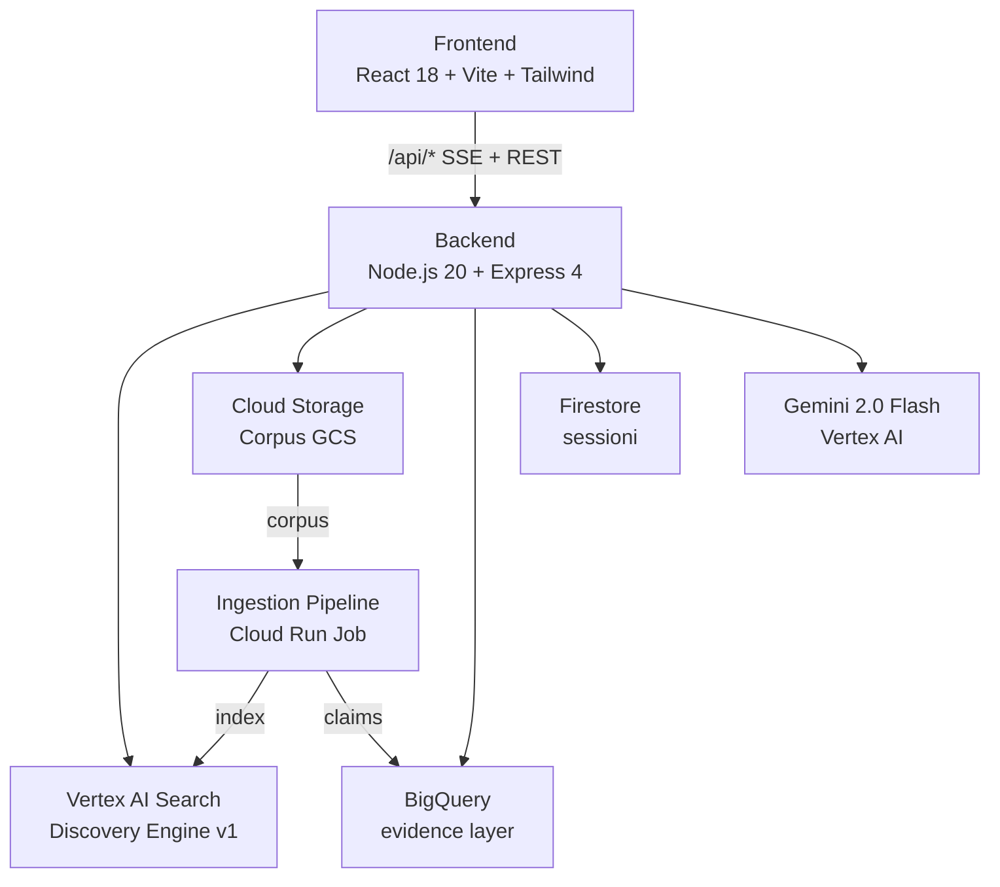
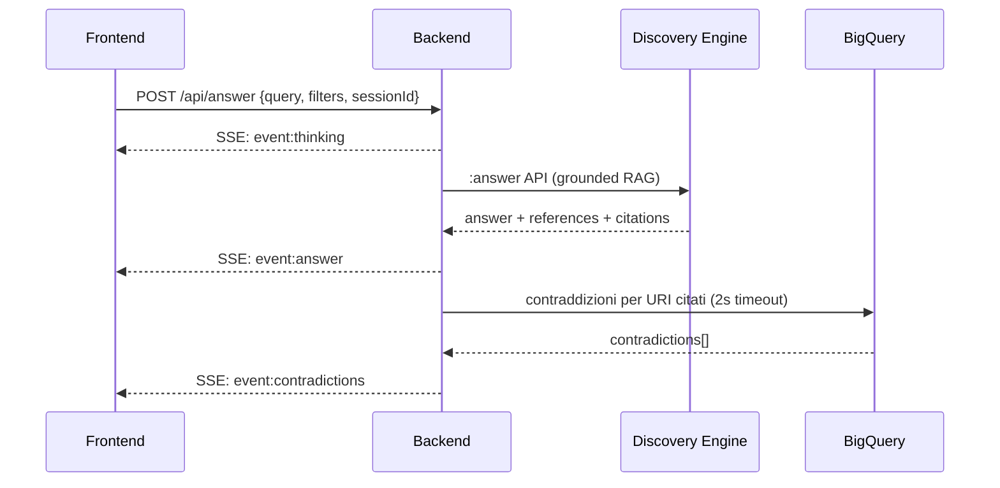
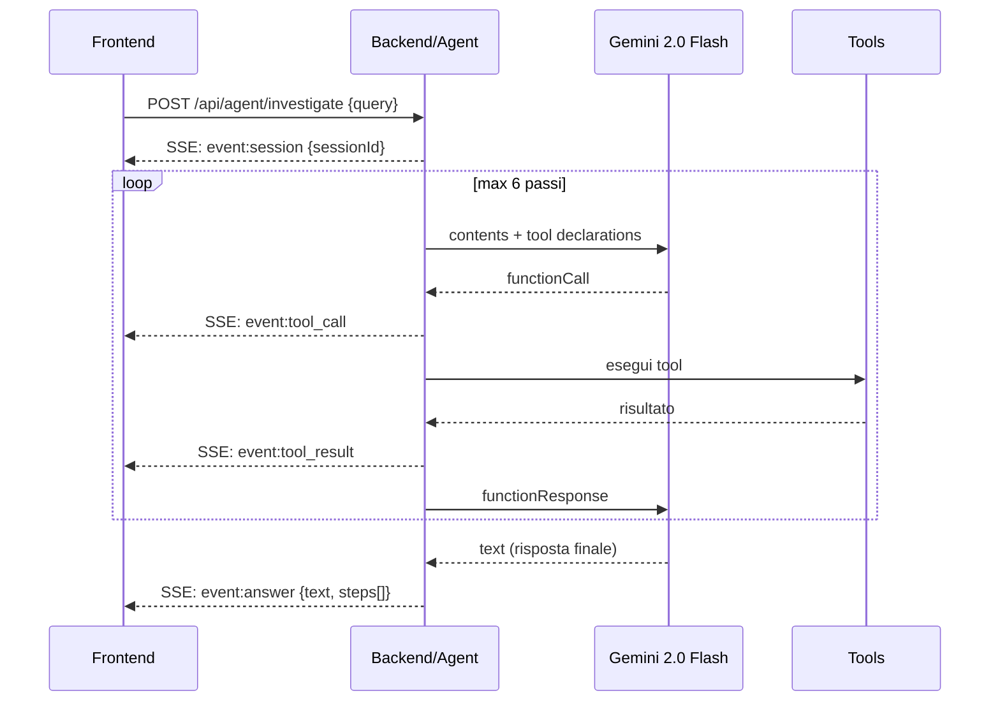
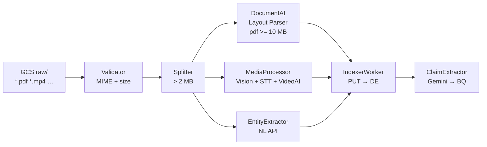
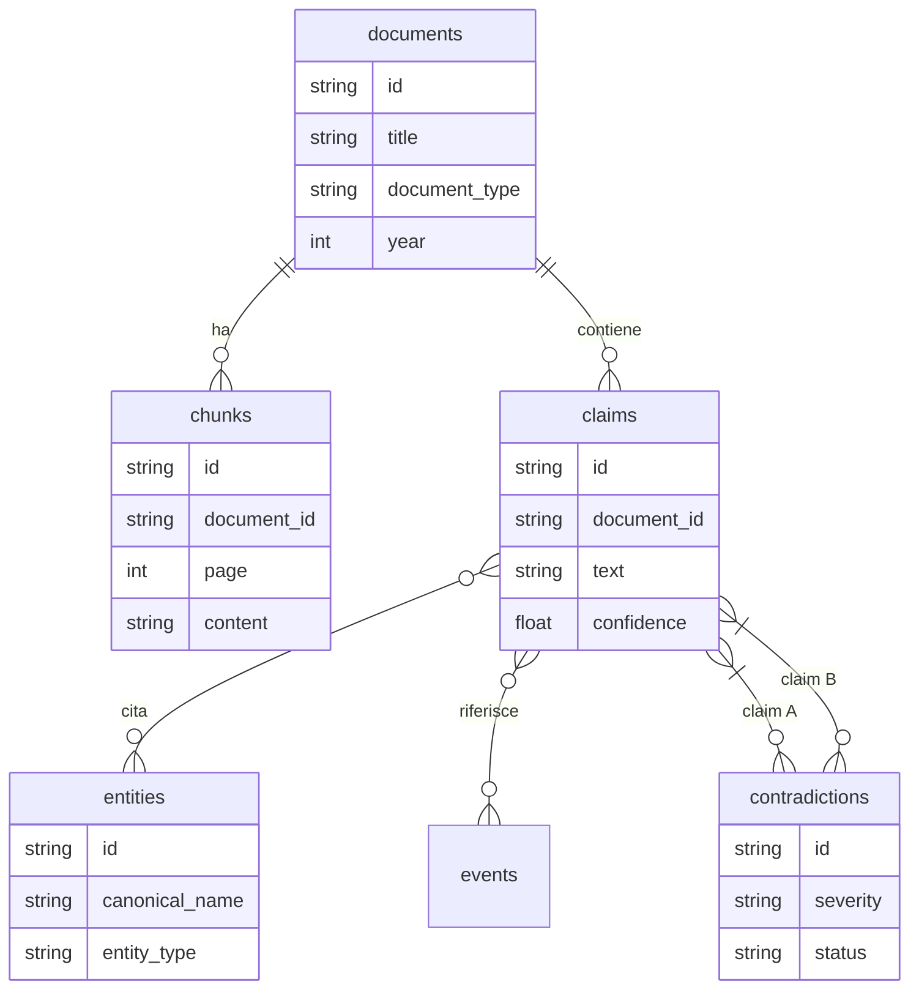

# Archivio Moby Prince

Piattaforma investigativa RAG sul disastro del Moby Prince (10 aprile 1991). Interrogazione in linguaggio naturale, rilevamento contraddizioni, agente AI multi-step, persistenza sessioni.


---

## Architettura



---

## Flusso risposta RAG



---

## Agente investigativo (ReAct)



---

## Pipeline di ingestion



---

## Quick start (Docker)

```bash
# 1 — Credenziali Google
gcloud auth application-default login

# 2 — Configurazione backend
cp backend/.env.example backend/.env
# Compilare almeno: GOOGLE_CLOUD_PROJECT, ENGINE_ID

# 3 — Avvio
docker compose up --build
# → http://localhost:5173
```

---

## Sviluppo locale

```bash
# Backend
cd backend && cp .env.example .env && npm install && npm run dev
# → http://localhost:3001

# Frontend (secondo terminale)
cd frontend && npm install && npm run dev
# → http://localhost:5173  (/api/* proxato verso :3001)
```

---

## Pagine

| Pagina | Route | Descrizione |
|--------|-------|-------------|
| Chat | `/` | RAG con citazioni, contraddizioni inline, filtri metadati |
| Timeline | `/timeline` | Cronologia eventi (BigQuery → GCS → fallback) |
| Dossier | `/dossier` | Browser GCS, upload, rename, drag-and-drop tra cartelle |
| Contraddizioni | `/contraddizioni` | Matrice con filtri gravità/stato |
| Investigazione | `/investigazione` | Agente multi-step con traccia tool call in tempo reale |
| Admin | `/admin` | Statistiche operative e budget giornaliero |

---

## API

Tutti gli endpoint richiedono `X-API-Key: <key>` quando `API_KEY` è configurata.
`GET /api/health` è sempre pubblico.

Rate limit: **20 req/min** per `/api/answer` e `/api/agent`; **120 req/min** per gli altri.

### Risposta RAG

| Metodo | Path | Note |
|--------|------|------|
| `POST` | `/api/answer` | SSE: `thinking` → `answer` → `contradictions` |
| `POST` | `/api/ask` | Alias `/api/answer` |
| `POST` | `/api/search` | Ricerca chunk senza generazione |

**Body `/api/answer`:**
```json
{
  "query": "stringa (max 2000)",
  "sessionId": "stringa (opzionale, multi-turn DE)",
  "maxResults": 10,
  "filters": { "documentType": "testimony", "year": 1991 }
}
```

**SSE:**
```
event: thinking       data: {"stage":"searching"}
event: answer         data: {answer, citations, evidence, session, meta}
event: contradictions data: {contradictions[], total}
event: error          data: {"message":"..."}
```

### Evidence e filtri

| Metodo | Path | Note |
|--------|------|------|
| `POST` | `/api/evidence/search` | Chunk workbench |
| `GET`  | `/api/evidence/documents/:id/chunks` | Richiede `DATA_STORE_ID` |
| `GET`  | `/api/evidence/chunks-by-gcs-path?path=` | Lookup per path GCS |
| `GET`  | `/api/filters/schema` | Schema filtri completo — sorgente di verità |

### Timeline

| Metodo | Path | Note |
|--------|------|------|
| `GET`  | `/api/timeline/documents` | Tutti i documenti con metadati |
| `GET`  | `/api/timeline/events` | BigQuery → GCS → vuoto |
| `PUT`  | `/api/timeline/events` | Salva array eventi su GCS |
| `POST` | `/api/timeline/generate` | Genera eventi via Gemini |

### Media

| Metodo | Path | Note |
|--------|------|------|
| `GET`  | `/api/media/:id/transcript` | Trascrizione con timestamp |
| `GET`  | `/api/media/:id/shots` | Shot list + URL firmati thumbnail |
| `GET`  | `/api/media/:id/labels` | Label Vision / Video Intelligence |

### Entità e eventi (richiede BigQuery)

| Metodo | Path | Note |
|--------|------|------|
| `GET`  | `/api/entities` | Lista con conteggio citazioni |
| `GET`  | `/api/entities/search?q=` | Ricerca per nome/alias |
| `GET`  | `/api/entities/:id` | Dettaglio |
| `GET`  | `/api/entities/:id/claims` | Claim cross-documento |
| `GET`  | `/api/entities/:id/events` | Timeline associata |
| `GET`  | `/api/events` | Lista eventi (`?from=&to=&type=`) |
| `GET`  | `/api/events/:id` | Dettaglio evento |

### Contraddizioni e claim (richiede BigQuery)

| Metodo | Path | Note |
|--------|------|------|
| `GET`  | `/api/contradictions` | Lista (`?status=&severity=&documentId=`) |
| `GET`  | `/api/contradictions/:id` | Dettaglio con testo claim A/B |
| `PATCH`| `/api/contradictions/:id` | Aggiorna `status`/`resolution` |
| `POST` | `/api/contradictions/detect` | Rilevamento pairwise |
| `GET`  | `/api/claims?documentId=` | Claim per documento |
| `POST` | `/api/claims/verify` | Verifica claim libero |
| `GET`  | `/api/claims/:id` | Dettaglio claim |

### Sessioni investigative (richiede Firestore)

| Metodo | Path | Note |
|--------|------|------|
| `POST`   | `/api/sessions` | Crea sessione |
| `GET`    | `/api/sessions` | Lista paginata (senza messaggi) |
| `GET`    | `/api/sessions/:id` | Dettaglio + messaggi |
| `PATCH`  | `/api/sessions/:id` | Aggiorna titolo/messaggi |
| `POST`   | `/api/sessions/:id/messages` | Append atomico (Firestore FieldTransform) |
| `DELETE` | `/api/sessions/:id` | Elimina |
| `GET`    | `/api/sessions/:id/export` | Download JSON |

### Agente multi-step

| Metodo | Path | Note |
|--------|------|------|
| `POST` | `/api/agent/investigate` | SSE con traccia tool call; `sessionId` per riprendere |

**SSE:**
```
event: session      data: {"sessionId":"<firestore-id>"}  ← sempre primo
event: thinking     data: {"step":1}
event: tool_call    data: {"tool":"search_documents","args":{...},"step":1}
event: tool_result  data: {"tool":"...","result":{...},"durationMs":312,"step":1}
event: answer       data: {"text":"...","steps":[...]}
event: error        data: {"message":"..."}
```

**Tool:** `search_documents`, `verify_claim`, `list_contradictions`, `get_entity_info`, `translate_text`.

### Storage GCS (richiede `GCS_BUCKET`)

| Metodo   | Path | Note |
|----------|------|------|
| `GET`    | `/api/storage/browse?prefix=` | Lista cartelle e file |
| `GET`    | `/api/storage/file?name=` | Download / proxy file GCS |
| `POST`   | `/api/storage/upload` | Upload multipart/form-data |
| `GET`    | `/api/storage/metadata?name=` | Metadati (sistema + custom) |
| `PATCH`  | `/api/storage/metadata` | Aggiorna metadati custom |
| `POST`   | `/api/storage/rename` | Rinomina file (sync GCS → DE) |
| `POST`   | `/api/storage/copy` | Duplica file |
| `DELETE` | `/api/storage/file?name=` | Elimina file |
| `POST`   | `/api/storage/move` | Sposta file |
| `DELETE` | `/api/storage/folder?prefix=` | Elimina cartella ricorsivamente |
| `POST`   | `/api/storage/rename-folder` | Rinomina cartella |
| `POST`   | `/api/storage/copy-folder` | Duplica cartella |

### Admin e health

| Metodo | Path | Note |
|--------|------|------|
| `GET`  | `/api/analysis/dossier` | Documenti indicizzati per workbench |
| `GET`  | `/api/admin/stats` | Budget Gemini/BQ, contatori sessioni |
| `GET`  | `/api/health` | `{"status":"ok"}` — sempre pubblico |

---

## Filtri metadati

`GET /api/filters/schema` è la sorgente di verità. La copia statica in `frontend/src/filters/schema.js` è il fallback offline — verificarne la sync con:

```bash
cd backend && npm run check-schema
```

| Chiave | Tipo | Valori / Range |
|--------|------|----------------|
| `documentType` | enum | testimony, report, expert_opinion, exhibit, decree, parliamentary_act, press, investigation |
| `institution` | enum | marina_militare, guardia_costiera, procura_livorno, commissione_parlamentare, tribunale, ministero_trasporti, rina, other |
| `year` | number | 1991–2024 |
| `legislature` | enum | X–XIX |
| `person` | text | nome/alias persona citata |
| `topic` | enum | incendio, collisione, soccorso, responsabilita, indennizzo, rotta, comunicazioni, radar, nebbia, vittime |
| `ocrQuality` | enum | high, medium, low |
| `mediaType` | enum | document, image, video, audio |
| `containsSpeech` | enum | true, false |
| `locationDetected` | text | luogo rilevato |

---

## Configurazione (`backend/.env`)

| Variabile | Obbligatoria | Default | Descrizione |
|-----------|:---:|---------|-------------|
| `GOOGLE_CLOUD_PROJECT` | **sì** | — | GCP project ID |
| `ENGINE_ID` | **sì** | — | Vertex AI Search engine ID |
| `GCP_LOCATION` | no | `eu` | Regione Discovery Engine |
| `DATA_STORE_ID` | no | — | Abilita chunk/document lookup |
| `GCS_BUCKET` | no | — | Bucket corpus — abilita `/api/storage/*` |
| `API_KEY` | no | — | Header `X-API-Key` per tutti gli endpoint |
| `FRONTEND_ORIGIN` | no | `http://localhost:5173` | CORS origin |
| `PORT` | no | `3001` | Porta HTTP |
| `NODE_ENV` | no | `development` | `production` → log NDJSON strutturato |
| `LOG_LEVEL` | no | `debug` | debug · info · warn · error |
| `CHUNK_CONTEXT_PREV` | no | `1` | Chunk precedenti per risposta RAG |
| `CHUNK_CONTEXT_NEXT` | no | `1` | Chunk successivi per risposta RAG |
| `BQ_PROJECT_ID` | no | `GOOGLE_CLOUD_PROJECT` | Progetto BigQuery |
| `BQ_DATASET_ID` | no | `evidence` | Dataset evidence layer |
| `BQ_LOCATION` | no | `EU` | Regione BigQuery |
| `FIRESTORE_DB` | no | `(default)` | Database Firestore sessioni |
| `GEMINI_LOCATION` | no | `us-central1` | Regione Vertex AI Gemini |
| `DOCAI_LOCATION` | no | `GCP_LOCATION` | Regione Document AI |
| `DAILY_GEMINI_LIMIT` | no | `500` | Max chiamate Gemini/giorno |
| `DAILY_BQ_LIMIT` | no | `2000` | Max chiamate BigQuery/giorno |

---

## Evidence layer BigQuery



```bash
bq mk --dataset --location=EU ${PROJECT_ID}:evidence
bq query --nouse_legacy_sql < docs/bigquery-schema.sql
```

---

## Deploy

### Backend → Cloud Run

```bash
ENGINE_ID=your-engine-id \
DATA_STORE_ID=your-datastore-id \
PROJECT=your-project-id \
  ./deploy/backend.sh
```

**IAM** `moby-prince-backend@PROJECT.iam.gserviceaccount.com`:

| Ruolo | Servizio |
|-------|---------|
| `roles/discoveryengine.viewer` | Vertex AI Search |
| `roles/storage.objectViewer` | Cloud Storage |
| `roles/bigquery.dataViewer` | BigQuery |
| `roles/datastore.user` | Firestore |
| `roles/aiplatform.user` | Vertex AI / Gemini |

### Frontend → Cloud Storage / Firebase Hosting

```bash
BACKEND_URL=https://moby-prince-backend-xxxx-ew.a.run.app ./deploy/frontend.sh
# Firebase:
TARGET=firebase BACKEND_URL=https://... ./deploy/frontend.sh
```

### Ingestion → Cloud Run Job

```bash
./deploy/ingestion.sh
gcloud run jobs execute moby-prince-ingestion --args="scan,gs://my-bucket/moby-prince/"
```

---

## Autenticazione GCP

Il backend usa **Application Default Credentials** — un unico `GoogleAuth` client condiviso da tutti i servizi via `backend/services/auth.js`.

| Ambiente | Risoluzione ADC |
|----------|----------------|
| Locale | `gcloud auth application-default login` |
| docker-compose | Volume `~/.config/gcloud` montato |
| Cloud Run | Workload Identity del service account |

---

## Struttura repository

```
├── backend/
│   ├── config.js            # Env validation + costanti centralizzate
│   ├── server.js            # Entry point (rate limit, middleware, route mount)
│   ├── routes/              # Un file per area funzionale
│   ├── services/            # Client REST GCP (auth, DE, BQ, Firestore, GCS, Gemini…)
│   ├── repos/               # Query helpers BigQuery
│   ├── transformers/        # Normalizzazione risposte DE → contratto API
│   ├── filters/             # Schema filtri + expression builder (sorgente di verità)
│   ├── middleware/          # Auth, rate limit, requestId, errorHandler, validateFilters
│   └── lib/                 # utils.js · sse.js
├── frontend/
│   └── src/
│       ├── pages/           # Chat, Timeline, Dossier, Contradictions, Investigation, Admin
│       ├── components/      # MessageBubble, EvidenceSection, DocumentPanel, FilterPanel…
│       ├── hooks/           # useChat, useFilters, useGcsBrowser, useDossier…
│       ├── filters/         # Copia statica schema (fallback offline)
│       └── lib/             # apiFetch (inietta X-API-Key)
├── ingestion/
│   ├── workers/             # Validator→DocAI→Media→Splitter→Entity→Indexer→Claim
│   ├── pipeline/            # Orchestratore + retry
│   ├── services/            # Auth, BQ insert, Gemini
│   └── cloudrun/            # CLI (ingest / scan / retry)
├── docs/
│   ├── bigquery-schema.sql
│   └── runtime-config.md
├── scripts/
│   └── check-filter-schema.js
├── deploy/
└── docker-compose.yml
```

---

## Stack

| Layer | Tecnologie |
|-------|-----------|
| Frontend | React 18, React Router v6, Vite, Tailwind CSS, lucide-react |
| Backend | Node.js 20, Express 4, helmet, express-rate-limit, pino |
| RAG core | Vertex AI Search — Discovery Engine v1 |
| AI generativa | Gemini 2.0 Flash, text-embedding-004 |
| Evidence layer | BigQuery REST API v2 |
| Sessioni | Firestore REST API v1 (atomic FieldTransform) |
| Multimedia | Vision API, Video Intelligence, Speech-to-Text v2 |
| NLP | Cloud Natural Language API |
| Storage | Cloud Storage |
| Auth | Google Application Default Credentials |
| Container | Docker, nginx 1.27 |

---

*Uso riservato — Commissione Parlamentare d'Inchiesta · Camera dei Deputati.*
