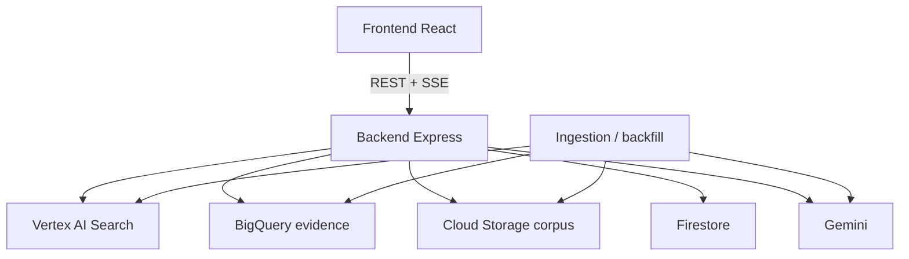

# Archivio Moby Prince

Piattaforma investigativa evidence-first sul disastro del Moby Prince.

Il repository serve a consultare un corpus documentale eterogeneo con quattro obiettivi operativi:

- interrogare il corpus in linguaggio naturale con citazioni apribili
- ricostruire una timeline strutturata con eventi unificati e fonti multiple
- navigare entità canoniche (`persone`, `navi`, `enti`, `luoghi`) con profili stabili
- mantenere un layer dati autorevole in BigQuery, coerente con GCS, Discovery Engine e le superfici UI

Il prodotto è pensato per demo interna seria: meno effetti “prototype”, più provenienza, più coerenza, meno ambiguità.

## Stato del prodotto

Superfici disponibili:

- `Chat` su `/` con risposte grounded e pannello fonti unificato
- `Timeline` su `/timeline` con eventi cronologici, accuratezza data e viewer condiviso
- `Entità` su `/entita` con tab `persone`, `navi`, `enti`, `luoghi` e profili dedicati
- `Dossier` su `/dossier` per raccolta e consultazione materiali su GCS
- `Investigazione` su `/investigazione` per analisi multi-step più profonda
- `Admin` su `/admin` per metriche operative essenziali

Decisioni architetturali importanti:

- il prodotto evita feature speculative non affidabili e privilegia attribuzione documentale e provenance
- BigQuery è la fonte autorevole per timeline, entità, claim e provenance strutturata
- il viewer usa un contratto condiviso `source + anchors`
- i profili AI delle entità devono essere materializzati o cachati persistentemente, non generati live per ogni apertura

## Stack

- Frontend: React 18, Vite, Tailwind
- Backend: Express, SSE, servizi Google Cloud
- Retrieval semantico: Vertex AI Search / Discovery Engine
- Structured evidence: BigQuery dataset `evidence`
- Storage: Google Cloud Storage
- Sessioni e stato leggero: Firestore
- Modelli: Gemini per estrazione, sintesi, verifica e arricchimento
- Runtime supportato: Node 20

## Requisiti

- Node 20
- progetto GCP configurato
- accesso a:
  - Discovery Engine / Vertex AI Search
  - BigQuery
  - Cloud Storage
  - Firestore
  - Vertex AI / Gemini
- credenziali ADC oppure API key Gemini dove previsto

`.nvmrc` è presente nel repo.

## Struttura del repository

```text
moby-prince/
├── backend/                 API Express, SSE, query BigQuery, trasformazioni risposta
├── frontend/                interfaccia React evidence-first
├── ingestion/               worker, script di backfill, pipeline multimodale
├── docs/                    documentazione tecnica allineata allo stato reale
├── eval/                    benchmark ed evaluation harness
└── scripts/                 utility locali
```

## Quick Start

### 1. Ambiente

Backend: `backend/.env`

Frontend: usa le variabili `VITE_*` previste dal progetto.

Le variabili più importanti lato backend sono:

```bash
GOOGLE_CLOUD_PROJECT=
GCP_LOCATION=eu
ENGINE_ID=
DATA_STORE_ID=
BQ_PROJECT_ID=
BQ_DATASET_ID=evidence
BQ_LOCATION=EU
GEMINI_LOCATION=us-central1
GEMINI_MODEL=gemini-2.5-flash-lite
GEMINI_API_KEY=
FRONTEND_ORIGIN=http://localhost:5173
API_KEY=
TRUST_IAP_HEADERS=false
GCS_BUCKET=
BUCKET_RAW=
BUCKET_NORMALIZED=
BUCKET_QUARANTINE=
DOCAI_PROCESSOR_ID=
DOCAI_LAYOUT_PROCESSOR_ID=
DOCAI_FORCE_ALL_PDFS=false
```

### 2. Installazione

```bash
nvm use

cd backend
npm install

cd ../frontend
npm install
```

### 3. Avvio locale

Backend:

```bash
cd backend
npm run dev
```

Frontend:

```bash
cd frontend
npm run dev
```

## Architettura ad alto livello



Flusso logico:

1. i documenti arrivano in GCS o nel corpus esistente
2. la pipeline di ingestion estrae testo, metadata, entità, claim, eventi e anchor
3. Discovery Engine indicizza i documenti/chunk per la ricerca semantica
4. BigQuery conserva il layer strutturato autorevole
5. backend e frontend consumano lo stesso contratto di provenance

## Modello dati strutturato

Tabelle principali:

- `documents`
- `chunks`
- `entities`
- `events`
- `claims`
- `source_anchors`
- `entity_profiles`
- `evidence_links`

Concetti chiave:

- `claims` sono l’unità atomica di affermazione documentale
- `events` unificano più claim sullo stesso fatto cronologico
- `source_anchors` rendono apribile la provenienza precisa:
  - pagina PDF
  - span testuale
  - timestamp audio/video
  - frame o shot per media
- `entity_profiles` materializzano summary, alias e ruolo in forma stabile

Vedi anche:

- [docs/evidence-model.md](docs/evidence-model.md)
- [docs/evidence-architecture.md](docs/evidence-architecture.md)
- [docs/bigquery-schema.sql](docs/bigquery-schema.sql)
- [docs/runbooks/reprocessing-corpus.md](docs/runbooks/reprocessing-corpus.md)

## Provenance e viewer

Il contratto condiviso backend/frontend per una fonte è:

```json
{
  "id": "source-id",
  "claimId": "claim-id",
  "documentId": "document-id",
  "title": "Titolo documento",
  "uri": "gs://bucket/path/file.pdf",
  "snippet": "estratto testuale",
  "pageReference": "p. 47",
  "mimeType": "application/pdf",
  "anchors": [
    {
      "id": "anchor-id",
      "anchorType": "page",
      "pageNumber": 47,
      "textQuote": "estratto",
      "timeStartSeconds": null,
      "frameReference": null
    }
  ]
}
```

Regole operative:

- se esiste `anchors[]`, il frontend usa quello
- il parsing di stringhe come `p. 47` è solo fallback
- chat, timeline, entità, dossier e investigazione devono aprire le fonti nello stesso modo

## API principali

Chat e ricerca:

- `POST /api/answer`
- `POST /api/ask`
- `POST /api/search`

Timeline:

- `GET /api/timeline/events`

Entità:

- `GET /api/entities`
- `GET /api/entities/search`
- `GET /api/entities/:id`
- `GET /api/entities/:id/context`
- `GET /api/entities/:id/claims`
- `GET /api/entities/:id/events`

Claims:

- `GET /api/claims?documentId=...`
- `GET /api/claims/:id`
- `POST /api/claims/verify`

Investigazione:

- `POST /api/agent/investigate`

Storage ed evidenze:

- `GET /api/evidence/documents/:id/chunks`
- `GET /api/storage/file`
- `GET /api/storage/metadata`
- `PATCH /api/storage/metadata`

Health:

- `GET /api/health`

## SSE

Le route SSE principali sono:

- `/api/answer`
- `/api/agent/investigate`

Eventi tipici:

- `thinking`
- `tool_call`
- `tool_result`
- `answer`
- `error`

## Ingestion e backfill

Script principali:

- `ingestion/scripts/bq-create-tables.sql`
- `ingestion/scripts/batch-detect.js`
- `ingestion/scripts/backfill-structured-layer.js`

Uso tipico per estrazione claim:

```bash
node ingestion/scripts/batch-detect.js --phase=claims --resume
```

Uso tipico per riallineare il layer strutturato:

```bash
node ingestion/scripts/backfill-structured-layer.js --phases=documents,anchors --replace
node ingestion/scripts/backfill-structured-layer.js --phases=entities,profiles --replace --entity-threshold=0.86
node ingestion/scripts/backfill-structured-layer.js --phases=events --replace --event-threshold=0.86
```

Per recuperare un intervallo specifico di claim candidati evento senza cancellare gli eventi gia scritti:

```bash
node ingestion/scripts/backfill-structured-layer.js --phases=events --event-offset=1305 --event-limit=45 --event-batch=15 --event-threshold=0.86
```

Cosa fa:

- enumera i documenti in Discovery Engine
- recupera i chunk dove disponibili
- usa Gemini per estrarre claim
- scrive in BigQuery
- usa fallback multimodale per PDF, immagini, audio e video quando non ci sono chunk testuali utili
- materializza documenti, source anchor testuali, entita canoniche, profili entita ed eventi timeline ad alta soglia
- scarta eventi senza claim sorgente reale e ID entita non canonici
- evita insert streaming per `events`, perche la tabella e partizionata su date storiche
- la config ingestion usa `GCS_BUCKET` come fallback del corpus raw reale quando `BUCKET_RAW` non e impostato

Limite importante:

- il backfill storico va considerato concluso solo quando `GCS ↔ DE ↔ BQ` sono coerenti
- senza `source_anchors` e `entity_profiles` popolati, la UI resta utilizzabile ma non completa
- gli anchor pagina PDF richiedono `page_reference` affidabile o reprocessing OCR/Document AI: gli anchor testuali non bastano per aprire automaticamente la pagina esatta

## Worker di pipeline

Nel path `ingestion/workers/` sono presenti worker per:

- OCR / sectioning con Document AI
- media processing per immagini, audio e video
- claim extraction
- entity extraction

Attenzione:

- il codice supporta una pipeline multimodale ampia
- per considerare il dataset “allineato” non basta che il supporto esista nel codice: va eseguito davvero sul corpus

## Test

Backend:

```bash
cd backend
npm test
```

Frontend:

```bash
cd frontend
npm test
npm run build
```

Cose da verificare sempre prima di push su `main`:

- test backend verdi
- test frontend verdi
- build frontend verde
- nessun riferimento legacy a feature o categorie non più operative
- timeline ed entità con `sources[]` e `anchors[]` coerenti

## Demo Checklist

Flusso minimo da provare:

1. aprire `/`
2. porre una domanda fattuale con fonti
3. aprire una citazione nel viewer
4. verificare apertura su pagina/timestamp corretto quando disponibile
5. aprire `/timeline`
6. controllare un evento con più fonti
7. aprire `/entita?tab=persone` e un profilo entità
8. verificare documenti, claim, eventi e entità correlate
9. aprire `/dossier`
10. aprire `/investigazione`

## Troubleshooting

### Il backend parte ma le route evidence restituiscono 501

Controllare:

- `BQ_PROJECT_ID`
- `BQ_DATASET_ID`
- credenziali GCP valide

### La chat risponde ma la timeline è vuota

Cause tipiche:

- `events` non popolata
- mismatch tra `events.source_claim_ids` e `claims.id`
- dataset non riallineato dopo reingestion

### I PDF non si aprono alla pagina corretta

Verificare:

- presenza di `source_anchors.page_number`
- fallback `pageReference`
- disponibilità reale del file su GCS

### Profili entità troppo lenti o instabili

Se succede, manca la materializzazione di `entity_profiles` oppure non è aggiornata dopo il backfill.

## Pulizia e manutenzione

Linee guida di manutenzione:

- evitare feature non affidabili anche se “accattivanti”
- documentare solo ciò che è operativo o chiaramente in backlog
- togliere codice e docs legacy invece di lasciarli convivere con il flusso nuovo
- mantenere backend e frontend allineati sullo stesso contratto dati

## Audit operativo

Per il controllo end-to-end del corpus e dei mismatch principali:

```bash
node scripts/audit-corpus.js
node scripts/audit-corpus.js --format=markdown --output=docs/reports/corpus-audit.md
node scripts/inventory-corpus.js --format=markdown --output=docs/reports/corpus-inventory.md --json-output=docs/reports/corpus-inventory.json
node scripts/snapshot-evidence.js --dry-run --format=markdown --output=docs/reports/evidence-snapshot-plan.md
node scripts/snapshot-evidence.js --format=markdown --output=docs/reports/evidence-snapshot-latest.md
node scripts/provision-normalized-layer.js --format=markdown --output=docs/reports/normalized-layer-status.md
node scripts/provision-normalized-layer.js --create-missing --format=markdown --output=docs/reports/normalized-layer-status.md
node scripts/provision-docai-processors.js --format=markdown --output=docs/reports/docai-processors-status.md
node scripts/provision-docai-processors.js --create-missing --format=markdown --output=docs/reports/docai-processors-status.md
node scripts/plan-pdf-reprocessing.js --format=markdown --output=docs/reports/pdf-reprocessing-plan.md
```

La matrice critica persistita del progetto e in:

- [docs/audit-matrix.md](docs/audit-matrix.md)
- [docs/reports/corpus-audit-latest.md](docs/reports/corpus-audit-latest.md)
- [docs/reports/corpus-inventory-latest.md](docs/reports/corpus-inventory-latest.md)
- [docs/reports/evidence-snapshot-latest.md](docs/reports/evidence-snapshot-latest.md)
- [docs/reports/normalized-layer-status.md](docs/reports/normalized-layer-status.md)
- [docs/reports/pdf-reprocessing-plan.md](docs/reports/pdf-reprocessing-plan.md)
- [docs/reports/docai-processors-status.md](docs/reports/docai-processors-status.md)
- [docs/reports/pdf-reprocessing-smoke.md](docs/reports/pdf-reprocessing-smoke.md)
- [docs/runbooks/reprocessing-corpus.md](docs/runbooks/reprocessing-corpus.md)

## Limiti noti

- la qualità finale dipende ancora dal riallineamento completo del corpus storico
- i media non-PDF possono avere ancore meno ricche del testo, a seconda del file e della pipeline eseguita
- il ranking entità è ancora guidato soprattutto da `mention_count` e qualità canonizzazione, non da una scoring pipeline dedicata

## Documentazione correlata

- [docs/evidence-architecture.md](docs/evidence-architecture.md)
- [docs/evidence-model.md](docs/evidence-model.md)
- [docs/evaluation.md](docs/evaluation.md)
- [docs/audit-matrix.md](docs/audit-matrix.md)
- [docs/reports/corpus-audit-latest.md](docs/reports/corpus-audit-latest.md)
- [docs/reports/corpus-inventory-latest.md](docs/reports/corpus-inventory-latest.md)
- [docs/reports/evidence-snapshot-latest.md](docs/reports/evidence-snapshot-latest.md)
- [docs/reports/normalized-layer-status.md](docs/reports/normalized-layer-status.md)
- [docs/reports/pdf-reprocessing-plan.md](docs/reports/pdf-reprocessing-plan.md)
- [docs/reports/docai-processors-status.md](docs/reports/docai-processors-status.md)
- [docs/reports/pdf-reprocessing-smoke.md](docs/reports/pdf-reprocessing-smoke.md)
- [docs/runbooks/reprocessing-corpus.md](docs/runbooks/reprocessing-corpus.md)
- [docs/bigquery-schema.sql](docs/bigquery-schema.sql)
